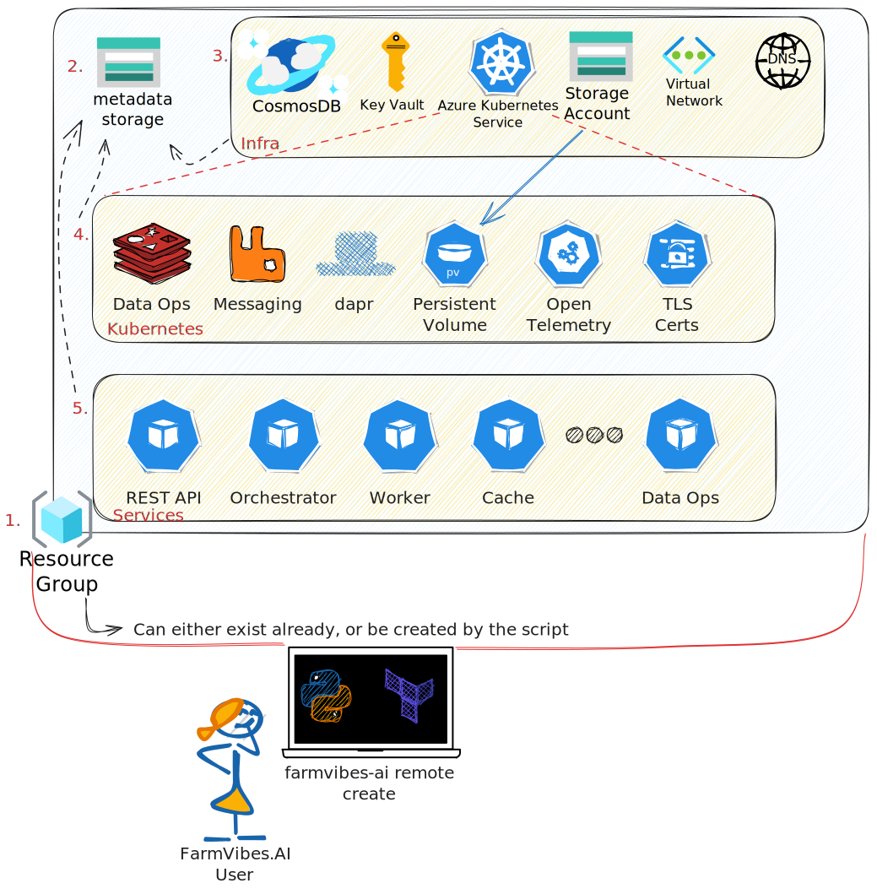

# Remote Cluster User Guide

This document provides an overview of the remote setup process for
FarmVibes.AI, detailing the main components, configuration options, and
customization possibilities.

The primary focus of this guide is to help users understand the structure and
organization of the Terraform scripts used to create and configure the remote
cluster and its associated Azure cloud components.

## Requirements

The FarmVibes.AI remote management script is
a [Python](https://python.org)-based utility that works with the assumption that whoever is
executing it has at least a *Contributor* role in the Azure subscription.
Please make sure you have Python installed before trying to setup a cluster.

The `az` command-line interface is a hard requirement for running the script.
Please follow the [Azure Command-Line Interface (CLI)
documentation](https://docs.microsoft.com/cli/azure/) for instructions on how
to install it. Make sure to install the version appropriate for your
architecture, otherwise the install process may fail.

If you have issues installing these utilities, please see the next section,
with instructions on how to build a FarmVibes.AI remote cluster from an Azure
Cloud Shell.

### Required Azure CPU quotas

In the default configuration, your subscription's CPU quota must support at
least 20 vCPUs in the region you choose. You will also need 12 `Standard DSv3
Family vCPUs` available. Please follow the [Azure quota increase
guide](https://learn.microsoft.com/en-us/azure/quotas/quickstart-increase-quota-portal).
The installer will fail if the quota is not available.

To summarize, the minimum numbers of CPUs required are:

 * Total Regional vCPUs: increase to at least 20
 * Standard DSv3 Family vCPUs: increase to at least 12
 * Standard BS Family vCPUs: increase to at least 8

You might have to enable the `Microsoft.Compute` provider in your subscription.
For instructions on how to do so, please proceed to the [Azure
providers](#azure-providers) section.

### Azure Cloud Shell installation

For cases when users are unable to install the FarmVibes.AI requirements in
a local machine, they can use an Azure Cloud Shell to complete installation.

To do so, please visit [https://shell.azure.com/](https://shell.azure.com/) to
start a new Azure Cloud Shell.

When asked whether to start a "Bash" or "PowerShell" shell, select "Bash".

Then, do the following manual steps:

```bash
pip install --upgrade pip  # to use the latest version of the package manager
# Do the following to install the `vibe_core` library and the `farmvibes-ai` command
pip install "git+https://github.com/microsoft/farmvibes-ai#egg =vibe_core&subdirectory=src/vibe_core"
az provider register --namespace Microsoft.Compute  # to enable compute provider
```

After running the above commands, please manually set the processor quota in
the Azure region you want to use, if you haven't done so. (See the section
[Required Azure CPU quotas](#required-azure-cpu-quotas) for details.)

Then, run an `az account show` and make sure you are connected to the correct
Azure subscription. If not, `az account list` will list all your subscriptions,
and running an `az account set $SUBSCRIPTION_ID` will set the current
subscription, where `$SUBSCRIPTION_ID` is the id of the subscription you'd like
to use.

Depending on your permissions, you may or may not need to create a resource
group manually to install the FarmVibes.AI AKS cluster to. If needed, you can
create a new resource group with `az group create --name resource_group_name
--location location_name`, where `resource_group_name` is the name of the
resource group, and `location_name` is the Azure Region where you will install
the cluster.

Once these requirements are met, you can follow the instructions on how to use
[the farmvibes-ai script](#the-farmvibes-ai-script).

### Azure Providers

Since the FarmVibes.AI remote management script needs to provision new
resources on Azure, it needs access to various [Azure
Providers](https://registry.terraform.io/providers/hashicorp/azurerm/latest/docs).
The script itself is able to register each required provider. As of the time of
writing of this document, the required providers are:

 * `Microsoft.DocumentDB`, for provisioning Cosmos DB
 * `Microsoft.KeyVault`, for managing an Azure KeyVault for managing secrets
 * `Microsoft.ContainerService`, for managing AKS itself
 * `Microsoft.Network`, for configuring public IPs and vnets
 * `Microsoft.Storage`, for provisioning
   [storage](https://learn.microsoft.com/en-us/azure/storage/) accounts
 * `Microsoft.Compute`, for provisioning Virtual Machines and Virtual Machines
   Scale Sets

### Setting the subscription

Some Azure users will have access to multiple subscriptions. To list all
subscriptions you have access to, use the command

```
az account list
```

Then, you can set your default subscription with the command

```
az account set ${YOUR_DESIRED_SUBSCRIPTION_ID}
```

## Azure environments

The AKS environment supports all [Azure (National) Cloud
environments](https://learn.microsoft.com/en-us/graph/deployments). Users can
choose which cloud they want to interact with by using the `--environment`
argument. Valid values for this argument are:

 * `public` (the default if not specified)
 * `usgovernment` (for a US Government cloud)
 * `german` (for the German sovereign cloud)
 * `china` (for the China sovereign cloud)

## Overriding the cluster admin

The `farmvibes-ai` install script uses the `az` CLI to infer the credentials of
the administrator of the cluster (= the user currently-logged in). In some
situations, the user performing the install might not be the user that will
actually manage the cluster with `kubectl`.

In such cases, you can use the `--cluster-admin-name` to define who will have
access to the cluster.

## Azure Cloud Components



The cluster configuration process works by provisioning different resource types on the Azure Cloud, always orchestrated
by the `farmvibes-ai remote` script, detailed in the next section.

The first component that needs to be configured is the Resource Group. The
script supports either using an existing Resource Group, or creating a new one.
We recommend letting the script create a new resource group, as the script will
always assume it is able to manage the resource group (even deleting resources
when cluster destruction is requested).

A **(1) Resource Group** provides a logical container for resources that are
deployed within an Azure subscription. In this project, a resource group is
created to organize and manage the resources related to the remote cluster,
making it easier to monitor, secure, and manage resources collectively.

After the `farmvibes-ai remote` script ensures the existence of the Resource
Group, it creates a **(2) Metadata Storage** account for the cluster
and related Azure resources. The script determines the name of this new storage
account by using a deterministic function that hashes the cluster name and the
resource group name.

Once the resource group and the metadata storage account exist, the script then
uses [TerraForm](https://www.terraform.io) to provision the infrastructure,
which takes place in three levels, described below.

### (3) Infrastructure

- [**Cosmos DB**](https://learn.microsoft.com/en-us/azure/cosmos-db/):
  the setup creates two Azure Cosmos DB accounts, each with
  their respective databases and containers. Azure Cosmos DB is a fully
  managed, globally distributed, multi-model database service designed for
  low-latency access to data and seamless horizontal scaling.

- [**Key Vault**](https://learn.microsoft.com/en-us/azure/key-vault/):
  a component to store and manage sensitive information such as
  secrets, connection strings, and credentials used by the services in the
  remote cluster.

- [**Azure Kubernetes Service (AKS)**](https://learn.microsoft.com/en-us/azure/aks/):
  a managed Kubernetes service that simplifies the deployment, management,
  and scaling of containerized applications using Kubernetes. In this project,
  an AKS cluster is created with the specified configurations, enabling you
  to deploy and manage your containerized services with ease.

- [**Storage Account**](https://learn.microsoft.com/en-us/azure/storage/):
  a cloud storage service that provides scalable, durable,
  and highly available storage for various types of data, such as blobs, files,
  queues, and tables. In this project, the Storage Account is set up to allow
  access from the virtual network created for the AKS setup, providing secure
  and isolated access to stored data.

- [**Virtual Network and Subnet**](https://learn.microsoft.com/en-us/azure/virtual-network/):
  Virtual Network (VNet) is the fundamental building block for creating a private
  and isolated network in Azure. It enables resources within the network to communicate
  with each other securely and efficiently.

- **Public IP Address**: Azure Public IP addresses enable you to communicate
  with resources over the internet, providing public access to services running
  in the remote cluster. The domain name label is created using a combination
  of the prefix and a hash of the resource group name, creating a unique and
  easily identifiable domain name for your services.

### (4) Kubernetes Components

After the infrastructure layer is complete, the script proceeds to provision
the kubernetes components, which are:

- [Redis](https://redis.io/) database for caching data about workflows executed and data generated
- [RabbitMQ](https://www.rabbitmq.com/) for messaging between FarmVibes.AI services
- [Dapr (Distributed Application Runtime)](https://dapr.io/) for abstracting service invocation and
  messaging
- A persistent volume that uses the storage account created in the previous
  step as backing store
- Open telemetry service for collecting telemetry data from services
- A certificate management service for configuring TLS endpoints for
  FarmVibes.AI services such as the REST API

### (5) Services

Finally, after the cluster basic components are configured, the script proceeds
to define and deploy the FarmVibes.AI services:

- **Rest-api (Server).** A webserver that exposes a REST API so users can
call workflows, track workflow execution and retrieve results.

- **Orchestrator.** This component manages workflow execution, transmitting
requests to workers and updating workflow status.

- **Worker.** A scalable component responsible for the actual workflow
operation computation. Instead of running the whole workflow at once, it
computes the atomic chunks processed by the user.

- **Cache.** This component sits between the orchestrator and
workers, it checks if an operation was previously executed and returns
cached results to the orchestrator.

- **Data Ops.** This component is responsible for managing data operations
such as keeping track of assets related to workflow execution and deleting
run data when requested.

## Installation and Setup

The installation and setup of the AKS cluster for FarmVibes.AI is managed by a
script named `farmvibes-ai`, under the `remote` action group. This script
automates the process of setting up the necessary infrastructure in Azure
(discussed above) and deploying the services.

Before running the script, you need to install the `vibe_core` package which
provides the `farmvibes-ai` command. Here's how to do it:

1. Make sure you have Python 3.8 or higher installed, with the `pip` command
available. See the [Python installation guide](https://www.python.org/downloads/) and
the [pip installation guide](https://pip.pypa.io/en/stable/installing/) for
instructions on how to install Python and pip.

2. Make sure you have git installed and configured. See the [git installation
guide](https://git-scm.com/book/en/v2/Getting-Started-Installing-Git) for
instructions on how to install git.

3. Now you have two options for installing the `vibe_core` package:

   3.1. Install the package directly from the GitHub repository, with pip
        `pip install "git+https://github.com/microsoft/farmvibes-ai#egg
=vibe_core&subdirectory=src/vibe_core"`

   3.2. Clone the repository with `git clone https://github.com/microsoft/farmvibes-ai.git`
   and install the package from the local copy with `pip install ./farmvibes-ai/src/vibe_core`.

4. After installing the `vibe_core` package, you can run the `farmvibes-ai` script.

### The farmvibes-ai script

The `farmvibes-ai` script manages the full lifecycle of the remote cluster,
including creation, deletion, and updates. The script is organized in
subcommands, each one responsible for a specific action. The subcommands, with
their descriptions and usage instructions, can be shown by running `farmvibes-ai
remote -h`.

To create a new remote cluster, you have to provide some required arguments to `farmvibes-ai remote setup`: the name of the cluster, the resource group name, and the location of the cluster, as well as an email address to generate the TLS certificates for the REST API.

The script will create a new resource group with the specified name, and use it to create the cluster, also creating it if it doesn't exist.

**NOTE**: We recommend you use an empty resource group to create your cluster.
If you ever need to destroy your cluster, all changes in your subscription will
be restricted to that resource group.

**WARNING**: If you decide to reuse an already existing resource group,
destroying the cluster will delete **ALL** resources in that resource group.

An example setup command is shown below:

```bash
farmvibes-ai remote setup \
  --region eastus \
  --cert-email testemail@example.com \
  --resource-group some-resource-group-name
```

Once the command runs, you will receive a hostname for the cluster, and the script will update FarmVibes.AI configuration files to point the default client to the newly created cluster's url.

```text
INFO - URL for your AKS Cluster is: https://test-build-1234-5678e9-dns.eastus2.cloudapp.azure.com
```

You can use to access the REST API and the FarmVibes.AI client, following the instructions in our [Client user guide](./CLIENT.md):

```python
from vibe_core.client import get_default_vibe_client
client = get_default_vibe_client("remote")
```

## Pre-registering providers

As mentioned before, the installer will auto-register each provider
automatically, but if you'd prefer to pre-register all providers beforehand,
you can execute the PowerShell script below (which, depending on your security
settings, might be easier to copy and paste the code in the prompt.)

<details>
  <summary>PowerShell script example (click to expand)</summary>

```powershell
# Define the list of providers to register
$providers = @(
    "Microsoft.DocumentDB",
    "Microsoft.KeyVault",
    "Microsoft.ContainerService",
    "Microsoft.Network",
    "Microsoft.Storage",
    "Microsoft.Compute"
)

# Initialize arrays for jobs and a hashtable for job-provider mapping
$jobs = @()
$jobProviderMap = @{}

# Start a job for each provider to register it
foreach ($provider in $providers) {
    $job = Start-Job -ScriptBlock {
        param($provider)
        $currentState = az provider show -n $provider --query "registrationState" -o tsv

        if ($currentState -ne "Registered" -and $currentState -ne "Registering") {
            az provider register --namespace $provider
        }

        do {
            $registrationState = az provider show -n $provider --query "registrationState" -o tsv
            if ($registrationState -ne "Registered") {
                Start-Sleep -Seconds 10
            }
        } while ($registrationState -ne "Registered")

        $provider
    } -ArgumentList $provider

    $jobs += $job
    $jobProviderMap[$job.Id] = $provider
}

# Periodically check the status of each job
while ($jobs | Where-Object { $_.State -eq 'Running' }) {
    Clear-Host
    foreach ($job in $jobs) {
        $state = $job.ChildJobs[0].JobStateInfo.State
        $providerName = $jobProviderMap[$job.Id]
        Write-Host "Provider $providerName is in $state state."
    }
    Start-Sleep -Seconds 10
}

# Retrieve and display the final status of each job, then clean up
foreach ($job in $jobs) {
    $providerName = Receive-Job -Job $job -Wait
    Write-Host "Provider $providerName is now registered."
    Remove-Job -Job $job
}
```
</details>

